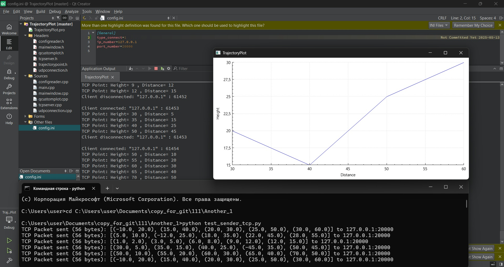

# Trajectory Plotting Application

This Qt C++ application visualizes projectile trajectories from network data (TCP or UDP). It plots height vs. distance, updating the graph with each new data packet.

## Features

- Real-time trajectory plotting.
- Supports TCP and UDP data input.
- Configuration via `config.ini` (connection type, IP, port).
- Uses QCustomPlot for display.
- Handles up to 30 trajectory points.
- Ignores points with negative height.

## Packet Format

- Mark (uint8[4]): Always "GloS"
- PacketType (uint32): Unique ID = 456
- DataSize (uint32): Size of the remaining data in bytes
- Number of Trajectory Point Structures (int32)
- Trajectory Point Structures (struct[]): Each structure contains:
    - Height (float)
    - Distance (float)

## Configuration (`config.ini`)

```ini
[General]
type_connect=1  ; 1 - TCP, 2 - UDP
ip_number="127.0.0.1"
port_number=20000
```

## Dependencies

- Qt Framework
- QCustomPlot

## How to Run

1. Build the Qt project (.pro file).
2. Run the executable.
3. Use the provided Python scripts (tcp_sender.py, udp_sender.py) to send test data.

## Screenshots

### TCP Screenshot



### UDP Screenshot


